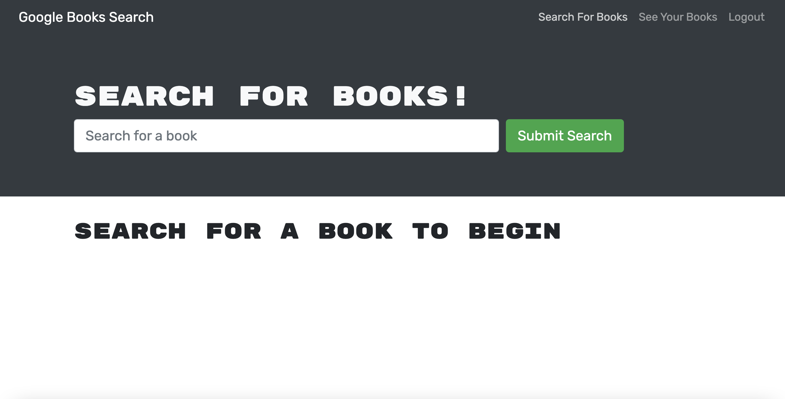

# Book Search Engine

## Table of Contents

- [Description](#description)
- [Installation](#installation)
- [Usage](#usage)
- [Contributing](#contributing)
- [Tests](#tests)
- [License](#license)
- [Questions](#questions)

## Description

Application allows users to create an account and search books while saving specific books they are interested in.

## Installation

No installation required, simply follow this link to the application.

## Usage

The use case is for someone interested in creating a list of books they want to save.

## Contributing

To contribute, clone the repo locally and create a branch to change or add code. Then request a PR once code is ready to be merged into the main branch.

## Tests

N/A

## License

    MIT

## Questions

- [GitHub profile](https://github.com/millersg47)
- Contact Me at millersg47@gmail.com with additional questions
